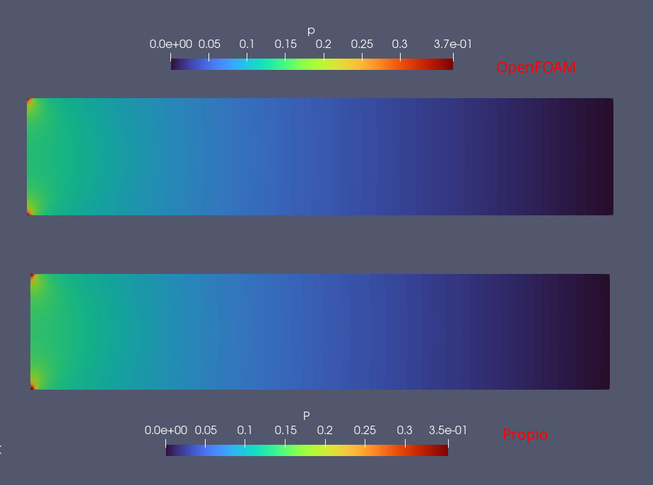

# Mini simulador 2D de flujo de fluidos

Simulador multiplataforma con la capacidad de solucionar problemas de flujo de
fluidos newtonianos, laminares, incompresibles y en estado estacionario para
geometrías rectangulares con un número arbitrario de parches.

## Uso

Luego de clonar el repositorio usar el siguiente comando para compilar los archivos:

```
cmake -S . -B build -DCMAKE_BUILD_TYPE=Release
cmake --build build -j
```

Para correr el caso por defecto utilizar:

```
./build/main
```

Los archivos

```
./include/config_malla.hpp
./include/config_CF.hpp
./include/config_control.hpp
```

configuran la malla, las condiciones de frontera y el control de la simulación,
respectivamente. Las instrucciones de uso para el mallador vienen en
`/include/malla_por_bloques.hpp`

## Roadmap

1. [ ] Refinar el código.
2. [ ] Mejorar la documentación.
3. [ ] Añadir la ecuación de la energía.
4. [ ] Implementar paralelización con `std::execution::par`

## Advertencia

Este es un simulador experimental, úselo bajo su propio riesgo.
